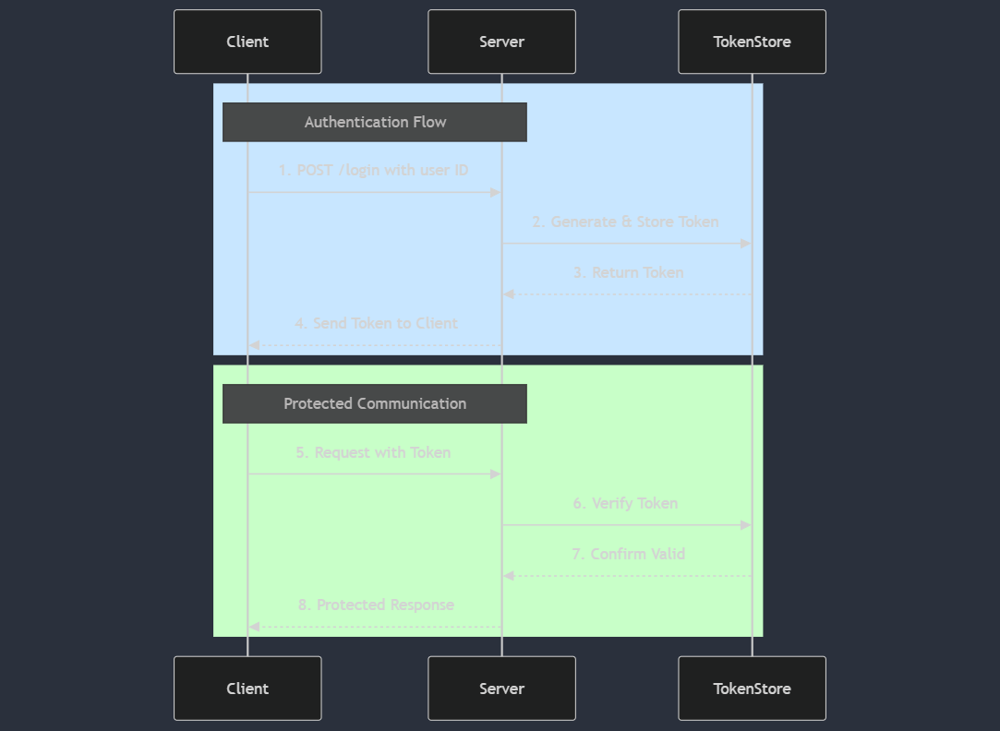

# Lab-04
# Authentication System with Web Tokens

This system demonstrates a basic implementation of token-based authentication using Flask and HTTP requests. The system consists of three main components that work together to provide secure communication between client and server.

## System Architecture


## Components Overview

### 1. Server (`my-server.py`)
The server component is built using Flask and handles:
- User authentication through the `/login` endpoint
- Token generation and validation
- Protected resource access through `/echo` endpoint
- Token storage and management

Key features:
```python
# Token generation
def generate_token():
    return secrets.token_hex(16)

# Protected endpoint example
@app.route("/echo", methods=['POST'])
def echo():
    # Verify token before processing
    if valid_token():
        return "You said: " + request.form['text']
```

### 2. Client (`my-calls.py`)
The client component uses the `httpx` library to:
- Initiate login requests
- Store received tokens
- Make authenticated requests to protected endpoints
- Handle server responses

Key features:
```python
# Login request
auth_data = {"id": "user@email.com"}
response = httpx.post(url + "login", data=auth_data)

# Protected request with token
protected_data = {
    "id": user_id,
    "token": token,
    "text": "Hello!"
}
response = httpx.post(url + "echo", data=protected_data)
```

### 3. Token Store (In-Memory Dictionary)
The token storage system:
- Maintains active user sessions
- Associates tokens with user IDs
- Provides token validation services

## How They Work Together

1. **Authentication Flow**
   - Client sends login request with user ID
   - Server generates a unique token
   - Token is stored in server's memory
   - Token is sent back to client

2. **Protected Communication**
   - Client includes token in requests
   - Server validates token before processing
   - If token is valid, request is processed
   - If token is invalid, request is rejected

3. **Security Features**
   - Cryptographically secure token generation
   - Token validation on every protected request
   - Clear error handling for invalid tokens
   - Proper HTTP status codes for different scenarios

## Testing the System

The system includes comprehensive tests:
1. Basic server connectivity
2. Login and token generation
3. Protected requests with valid tokens
4. Invalid token handling

Example response:
```
Test 1: Basic server connection
Status code: 200
Response: Authentication server running

Test 2: Login attempt
Status code: 200
Response: {"message":"Login successful","token":"6ebd2cc8..."}

Test 3: Protected request with valid token
Status code: 200
Response: You said: Hello from authenticated user!

Test 4: Protected request with invalid token
Status code: 401
Response: {"error":"Invalid token"}
```

## Setup Instructions

1. Start the server:
```bash
pip3 install Flask
python3 my-server.py
```

2. Make port public in GitHub Codespace:
   - Open Ports tab
   - Right-click port 5000
   - Set visibility to "Public"

3. Run the client:
```bash
pip3 install httpx
python3 my-calls.py
```

Note: Update the URL in `my-calls.py` to match your Codespace's forwarded address.